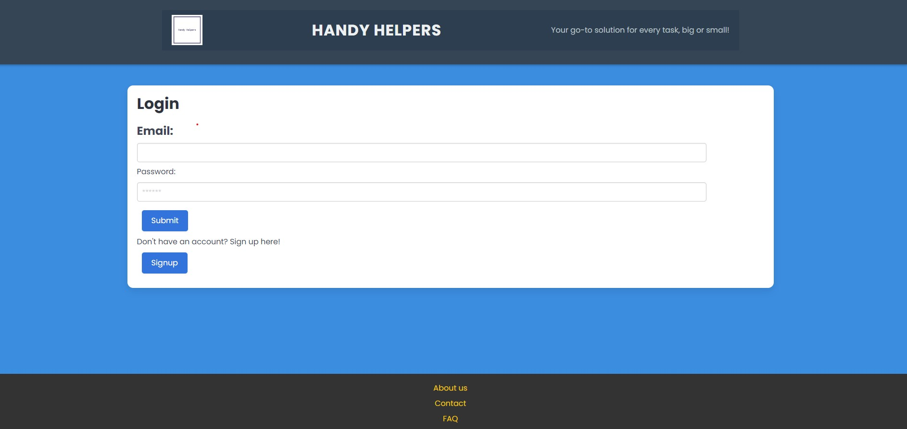
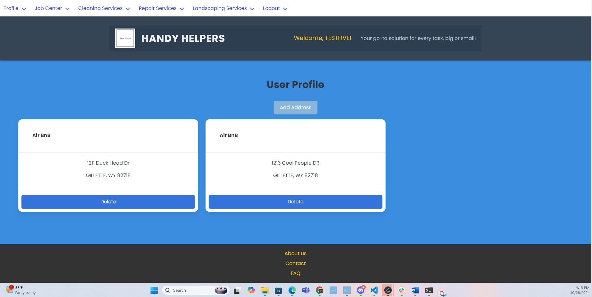
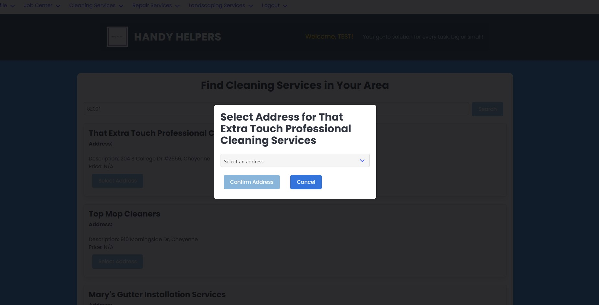
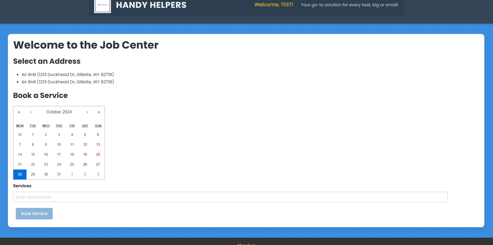

# Handy Helpers

## Description
Handy Helpers is a user-friendly app designed to help you manage all your property-related services and contractors in one convenient place. Our vision is to create a seamless platform where users can easily organize the services they need for their properties. Simply create an account, add your properties, and start searching for nearby services. Whether you're looking for cleaning, repair, or landscaping services, Handy Helpers offers a wide range of options. Once you've found the right provider, you can assign them to a property and schedule jobs directly on your calendar.

## Table of Contents
- [Installation](#installation)
- [Usage](#usage)
- [License](#license)
- [Contributing](#contributing)
- [Questions](#questions)


## Installation
Follow these steps to install the application:
1. Clone the repository using the `git clone` command.
2. Set up a database (MongoDB Atlas) or can run MongoDB Compass for running locally. 
3. To incorporate third party GooglePlaces API fetch calls will need to establish and account and generate a key. 
2. Install the dependencies by running the following command in your CLI: `npm install`.

### Environment Variables
    - Create a .env file in the server directory of the project.
    - Add the following environment variables to the .env file, replacing the placeholder values with your actual database credentials:
    ```bash
    JWT_SECRET="your secret"
    NODE_ENV=development
    GOOGLE_PLACES_API_KEY: "your key"

### Running the Application
 Start the application:
    ```bash
    -npm run develop (root)

    - Open your web browser and go to http://localhost:3001 to view the application.


## Usage
### User Authentication

*   Sign up for a new account or log in using your existing credentials.
*   After logging in, you will be redirected to the Profile Page.

*   Login: Users can login to be redirected to their Profile page. 

### Navigate to Service Providers 
*   Canclick on the various service provider links listed in the Navigation bar and enter your zip code to search near you. 

- Calendar feel free to use the calendar located on the Job Center, to track different services for your properties. 

### Add Services to you Calendar on the Job Center 
* Feel free to organize your various scheduled jobs on the Job Center Calendar. 

## License
This project is licensed under the [MIT license](https://opensource.org/license/MIT).

## Check out the deployed application on Render here: https://handyhelpers.onrender.com/

### link to repo: https://github.com/JacqMcQ/HandyHelpers

## Mock-Up




[Sign-up](client/src/pages/Signup.jsx)







## Contributing
- JavaScript
- Bulma
- Express
- Node
- Mongoose
- MongoDB Atlas
- MongoDb Compass
- Insomnia
- ESLint
- Google API
- GraphQL
- dotenv
- JSON
- React
- JWTe
- Render
- Prettier

## Citations:

*   Axios. (n.d.). Introduction to Axios. Axios HTTP Documentation. Retrieved October 12, 2024, from https://axios-http.com/docs/intro
*   Express.js. (n.d.). Using Middleware [Express.js documentation]. Retrieved October 15, 2024, from https://expressjs.com/en/guide/using-middleware.html
*   GooglePlaces API (n.d) PlacesAPI Retrieved 10/10-10/25 from https://developers.google.com/maps/documentation/places/web-service
*   AI (ChatGPT and Tabnine were used for debugging multiple issues with mutations and schemas as well as correcting for proper syntax)
*   Render. (n.d.). Adding multiple databases to a single instance [Render documentation]. Retrieved August 22, 2024, from https://docs.render.com/databases#adding-multiple-databases-to-a-single-instance
*   Render. (n.d.). Deploys [Render documentation]. Retrieved August 22, 2024, from https://docs.render.com/deploys
*   University of Texas at Austin. (n.d.). UTA-VIRT-FSF-PT-05-2024-U-LOLC [GitHub content]. Retrieved August 15, 2024, from https://git.bootcampcontent.com/University-of-Texas-at-Austin/UTA-VIRT-FSF-PT-05-2024-U-LOLC

## Questions
For any questions, please reach out to us at:
- [ebaby-ak](https://github.com/ebaby-ak)
- [JacqMcQ](https://github.com/JacqMcQ)
- [davidevett](https://github.com/davidevett)
- [chrvera] (https://github.com/chrvera)
- [edamama] (https://github.com/edamama)

